Adding Mission Panels to items
=====================

.. contents:: Contents
    :depth: 3

Creating the Mission Panel
---------------------

.. note:: 
    **This is an advanced topic, so it is preferred that you already have some experience modding Astroneer.**

In Unreal Engine, Starting from the ``Content`` folder in the **ModdingKit** Project, right click in the **Content Browser** and create a folder named ``ControlPanels`` then in that folder create another called ``Missions``, and after creating those directories the path should now look something like this: ``/Content/ControlPanels/Missions/`` in the **Content Browser**.

.. note:: 
    Any asset created in the ``/Content/ControlPanels/Missions/`` directory, is not to be packed with the mod itself, we are creating these assets just for referencing purposes.

Go to the ``/Content/ControlPanels/Missions/`` directory that you just created in the **Content Browser**, and right click in the **Content Browser** to create a new BP Class that inherits from the ``ControlPanel`` Class, and name it ``MissionsControlPanel``.

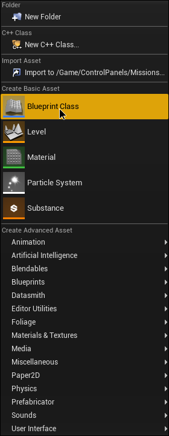

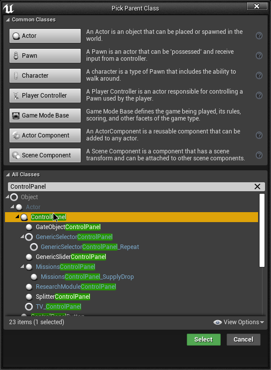

In the asset, create a variable and name it exactly this ``DisplayWidgetClass``, then in the properties of the variable set it to be a ``Widget`` Class Reference, after doing that now compile and save this asset.

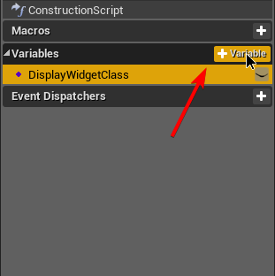

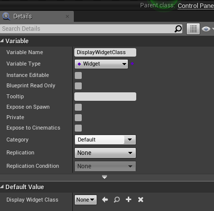

Now back to the ``Missions`` folder in the **Content Browser**, right click in the **Content Browser** and create a new BP Class that instead now inherits from the ``MissionsControlPanel`` and name it ``MissionsControlPanel_SupplyDrop``.

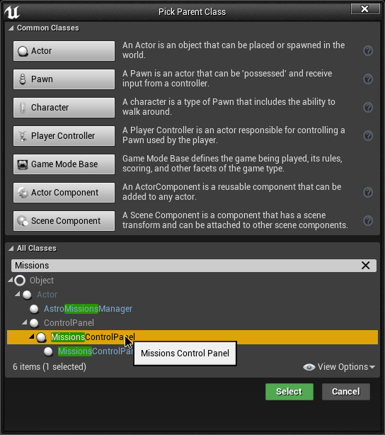

Now in this asset, create a new function and name it ``InitSupplyDropPoints`` and then add an input which should be an array of ``Scene Component`` Object References, now compile and save this asset.

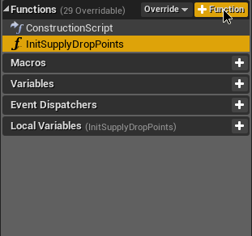

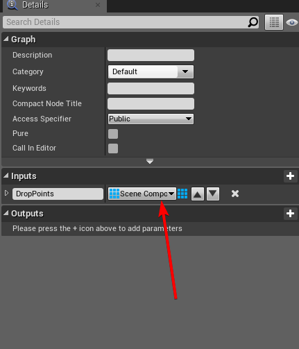

Again, back to the ``Missions`` folder in the **Content Browser**, now right click in the **Content Browser** and create a Widget Blueprint by going to ``User Interface -> Widget Blueprint`` in the right click menu, and name it ``MissionPanelPrimary``

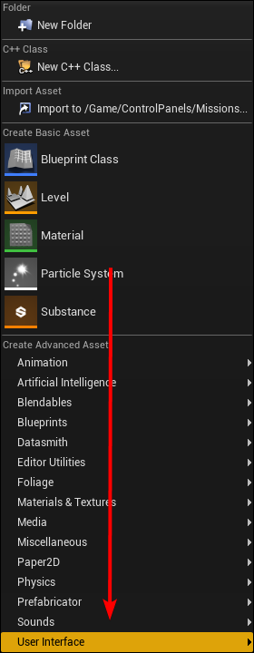

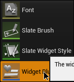

After creating the assets and the functions/variables for them, go to your item's BP, and create a ``Child Actor Component`` in the BP, position it how you like and set the ``Child Actor Class`` to the ``MissionsControlPanel_SupplyDrop`` class.

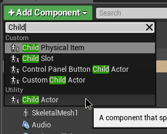

.. image:: MissionsOnItems-SetChildActorClass.png
  :width: 250

Now in the ``Child Actor Template`` dropdown, click on the Default dropdown and set the ``DisplayWidgetClass``'s class to ``MissionPanelPrimary``

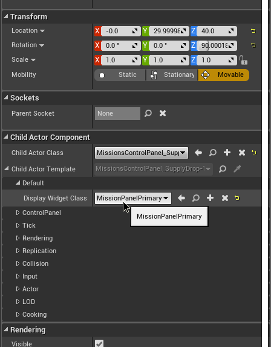

Creating & Linking the Supply Drop Points
--------------------

In your items BP create 3 new ``Scene`` Components and name them accordingly (ex. ``SupplyDropPoint`` 1, 2, 3)

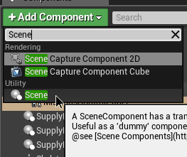

Then in the BP Graph, add a ``Cast to MissionsControlPanel_SupplyDrop`` node, and get your Child Actor Component's ``Child Actor`` by using the ``Get Child Actor`` and have the target be the ``Child Actor Component``, and connect the ``Actor Object Reference`` from the ``Get Child Actor`` node to the ``Object`` input on the ``Cast to`` node.

Now connect the ``Cast to`` node's Exec input to somewhere on the ``Begin Play`` Event, and then call the ``InitSupplyDropPoints`` using the ``As MissionsControlPanel_SupplyDrop`` output.

Get the SupplyDropPoints made earlier and use a ``Make Array`` node to turn all 3 into an array and connect the array output to the ``Drop Points`` input on the function

(use image below for reference if confused)

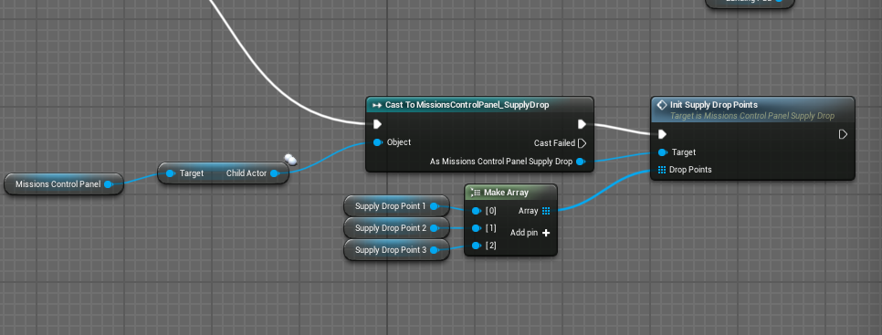

Result
--------------------
There you have it, now you can compile and save, package the mod and you should have a working mission panel on your item!

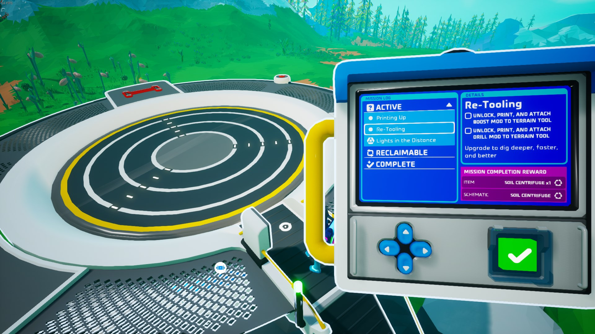