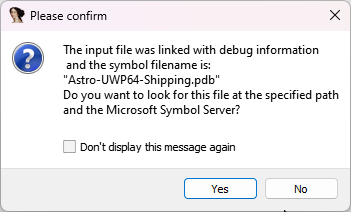
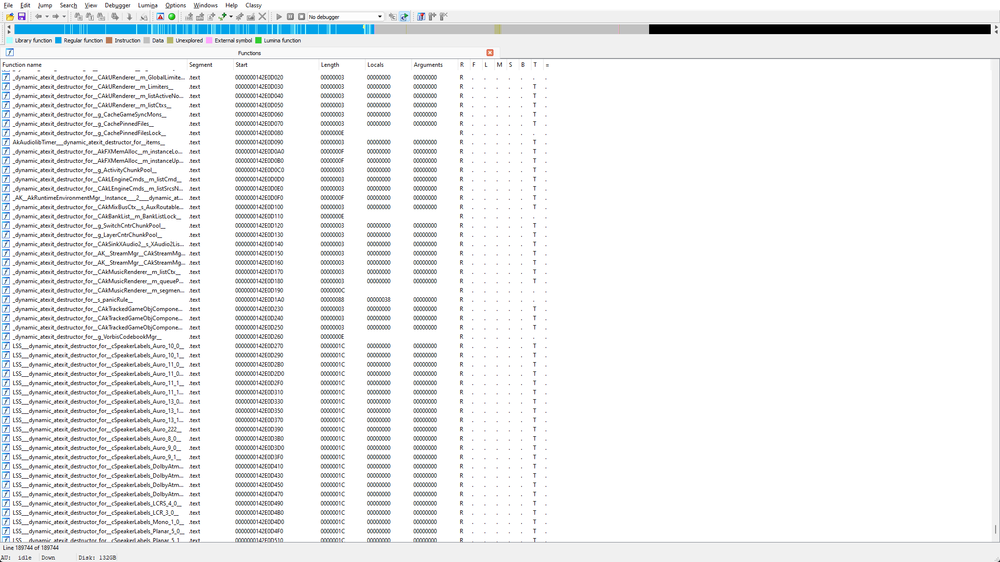
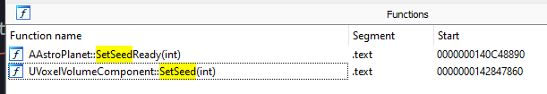
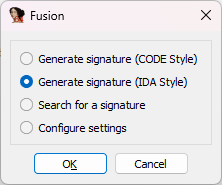
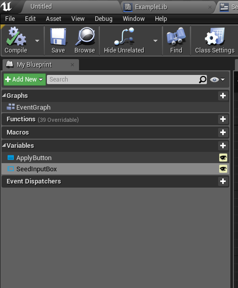
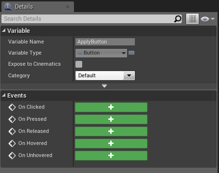
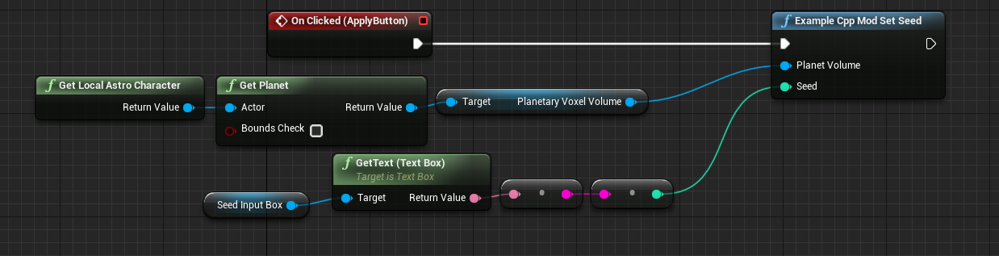
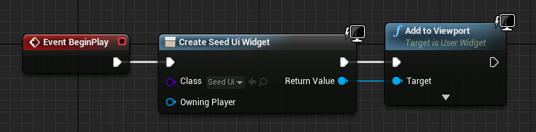

Writing C++ Mods
=================

.. contents:: Contents
    :depth: 3

Why?
----

C++ Modding allows you to run native c++ code without any blueprint restrictions.

This means you can do whatever you want with the game, and modify the memory to your liking, which opens a whole new world of possibilities.

Examples include: Network requests, hooking game functions, calling native c++ game functions that are not exposed to blueprints, etc.

But with great power come great possibilities to break everything, this article will try to explain how to avoid common pitfalls.

What we will be making
----------------------

In this article we are going to make a mod that allows you to set your world seed at runtime.
This is a great example because you learn how to call c++ from blueprints, call native c++ functions, and some reverse engineering.

Prerequisites
----------------

* Unreal Engine modkit :doc:`set-up <./kitSetup>`
* Visual Studio 2022
* Git
* `IDA Free <https://hex-rays.com/ida-free/>`_
* C++ knowledge
* Basic `CMake <https://cmake.org/documentation/>`_ knowledge
* Some reverse engineering knowledge

.. warning:: 

    You will need both, Visual Studio 2017 for the modkit, and 2022 for the cpp mod part.
    This is because the C++ mod will be using the c++23 standard.

Preparing for making the mod
----------------------------

Let's actually discuss what this mod will do.

We want the mod to have a blueprint widget, that will be always visible, this widget will have an input box
and a button, that, when pressed, will set the current planet's seed. 

The general rule of thumb is to do as much work in blueprints as that is less error prone.
So let's see what can and what we cannot do in blueprints.

Blueprints:
    * Input box
    * Input button
    * Getting values from widgets
    * Getting current planet

C++:
    * Calling the native set seed function

As we see, we can fit most of the stuff into blueprint code, so the c++ part will not be too complicated in this tutorial.

Still, how do we know what set seed function to call? We can't call functions here like you would when just writing an Unreal Engine game.

For us to know what to call, we need to do some reverse engineering, don't worry, this shouldn't be too hard.

Because we have the debug information of a slightly older Astroneer version, we will have it way easier, because we will not be doing it from scratch.

Preparing IDA
-------------

After you have installed IDA, find where it is installed and open that folder.

You should see a ``plugins`` folder inside of it, open the ``plugins`` folder.

We will be using the `Fusion Plugin <https://github.com/senator715/IDA-Fusion/releases/download/1.3/IDA-Fusion.zip>`_ to generate function signatures.

Download this plugin and unpack it into the ``plugins`` directory.

Now open IDA.

Finding the native set seed function
-------------------------------------

Download the `debug files <https://drive.google.com/file/d/1sBfG3fWWT-UJxRfNlRaunVUeUcGtDd3C/view>`_ and unpack them anywhere.

Now open the .exe with IDA and without changing any options, press ``ok``.

After some time you will see a window like this:

We want the debug information to be loaded, so press ``yes`` here.

.. note::

    If you see a window with an error about struct member alignment calculations - just ignore it.

Now wait for the analysis to finish, when it's finished you will see ``AU: idle`` in the bottom left corner, this will take a while, so grab a coffee.

After the analysis has finished, open View->Open Subviews->Functions.

Now you will see a functions window like this:

In this window, press ``Ctrl+F`` to start searching for functions, now type `SetSeed` and wait for it to show you the search results.

You should see search results similar to this:

How do I know which one of these to choose? 

Double-click on any of them and press ``F5``, you will see the function's decompiled code.

Looking at the code can help you understand which one to choose.

In this example, the ``AAstroPlanet::SetSeedReady`` just calls ``UVoxelVolumeComponent::SetSeed``, so it doesn't matter much.

We will be using ``UVoxelVolumeComponent::SetSeed`` in this tutorial, so double click that function in the functions list.

Now go to Edit->Plugins->Fusion, you will see a window like this:

In this window choose ``Generate Signature (IDA Style)`` and press ``OK``.

After it finishes generating the signature, you will see it in the ``Output Window``.

.. note::

    If you don't have the ``Output Window``, go to Windows->Output Window

Now copy the signature from the ``Output Window`` and save it someplace, it should be something like this:
``48 8B 87 ? ? ? ? 48 85 C0 75 ? 48 8B CF E8 ? ? ? ? 48 8B C8 E8 ? ? ? ? 83 F8``.

Setting up the development environment
--------------------------------------

Now we are ready to set up the c++ sdk.

To clone this repo use ``git clone https://github.com/AstroTechies/UnrealCppLoader``.

.. warning:: 

    Don't clone this repo inside of your mod folder.

After you have cloned this repo, open the ``UnrealCppLoader`` folder and create an ``ExampleCppMod`` folder.

This folder will be the folder that contains your cpp code.

Open this folder and create a ``CMakeLists.txt`` file.

.. note:: 

    Open the ``CMakeLists.txt`` file inside the ``ExampleCppMod`` folder not inside of the root folder.

This file tells the buildsystem how to compile your cpp code.

Copy this code into your ``CMakeLists.txt`` file:

.. code-block:: cmake

    # This line declares your mod as a library and sets the source files
    # to be compiled for your mod
    add_library(ExampleCppMod SHARED "dllmain.cpp" "ExampleCppMod.h" "ExampleCppMod.cpp")

    # This line links your mod with the modloader, this is required to
    # use the modloader apis
    target_link_libraries(ExampleCppMod PUBLIC UnrealCppLoader)

    # This line sets the C++ standard to C++23
    set_property(TARGET ExampleCppMod PROPERTY CXX_STANDARD 23)

Now it's time to let the build system know about your mod.

Open the ``CMakeLists.txt`` file in the root directory (UnrealModLoader).

Add these lines to the end of the file:

.. code-block:: cmake

    # This tells the build system about your mod
    add_subdirectory("ExampleCppMod")

Now go back into the ``ExampleCppMod`` directory and create the `ExampleCppMod.h` file.

This file is what will contain some information about your mod, as well as the mod class.

Copy the following code into this file:

.. code-block:: cpp
    
    #pragma once
    // Include the modloader api
    #include <Mod/Mod.h>

    class ExampleCppMod : public Mod
    {
    public:
        // Basic Mod Info
        ExampleCppMod()
        {
            ModName = "ExampleCppMod";
            ModVersion = "1.0.0";
            ModDescription = "Example astroneer cpp mod";
            ModAuthors = "You";
            ModLoaderVersion = "1.0.0";

            // Don't change this line
            CompleteModCreation();
        }

        // Called When Internal Mod Setup is finished
        virtual void InitializeMod() override;
    };

This declares your mod's class and initializes some variables to let the modloader know about your mod.

Now we need to actually create the mod implementation, so it's time to create the ``ExampleCppMod.cpp`` file.

Get the signature that you copied from IDA ready.

Copy the following code into the file:

.. code-block:: cpp

    #include "ExampleCppMod.h"
    #include <Memory/Pattern.h>
    #include <cstdint>
    #include <iostream>

    // To declare a blueprint function this macro needs to be used
    BPFUNCTION(ExampleCppMod_SetSeed)
    {   
        // Input params in Kismet(Unreal blueprints) are done using a struct
        // So we are creating a struct with the same input parameters we made in the editor.
        struct InputParams
        {
            UE4::UObject* VolumeComponent;
            int32_t Seed;
        };

        // This will get the paramters from the stack
        auto Input = stack->GetInputParams<InputParams>();

        // This tries to find a memory address that has data matching that pattern
        // This is where you paste the signature you copied
        auto SetSeedFunc =
            Pattern("REPLACE_THIS_WITH_SIGNATURE")
                .Get(0) // Gets the address at offset 0
                .Get<void(UE4::UObject *, int32_t)>(); // reinterprets the address as a function pointer

        if (SetSeedFunc != nullptr) {
            // Calling the set seed function
            SetSeedFunc(Input->VolumeComponent, Input->Seed);
        }
        
        // Returning the execution result back to blueprint
        stack->SetOutput<bool>("Success", SetSeedFunc != nullptr);
    }

    void ExampleCppMod::InitializeMod()
    {
        // This initializes UE4 SDK and sets up hooks
        UE4::InitSDK();
        SetupHooks();

        // This registers the function as a blueprint function
        REGISTER_FUNCTION(ExampleCppMod_SetSeed);
    }

.. note:: 

    Make sure to replace the ``REPLACE_THIS_WITH_SIGNATURE`` with the signature you copied from IDA.

Our first c++ mod is almost ready to be compiled, now we just need to create the entrypoint.

Create a `dllmain.cpp` file, and paste the following code into it:

.. code-block:: cpp

    #include "ExampleCppMod.h"
    #include <windows.h>

    void CreateMod()
    {
        // Create the mod instance
        auto CoreMod = new ExampleCppMod();
    }

    // This will get called when the DLL gets injected
    BOOL APIENTRY DllMain(HMODULE hModule, DWORD ul_reason_for_call, LPVOID lpReserved)
    {
        switch (ul_reason_for_call)
        {
        // Filtering to only create the mod on dll injection
        case DLL_PROCESS_ATTACH:
            CreateMod();
        case DLL_THREAD_ATTACH:
        case DLL_THREAD_DETACH:
        case DLL_PROCESS_DETACH:
            break;
        }
        return TRUE;
    }

Now we are ready to compile the mod, open Visual Studio 2022, and select the ``Open a local folder`` option.

In the file picker dialog select the ``UnrealModLoader`` folder.

Press Build->Build All, after it finishes go to the `out/build/x64-Debug/ExampleCppMod` folder and you will see the `ExampleCppMod.dll` in there, this is your compiled mod.

We are finished with the c++ part and now it's time to link it with the blueprint part.

Writing the blueprint part
--------------------------

It's recommended to first make a simple blueprint mod using the :doc:`/guides/kitModding` guide.

Create a folder for your mod and call it ``ExampleCppMod`` and open it.

Creating a function library
~~~~~~~~~~~~~~~~~~~~~~~~~~~

Now right click go to Blueprints->Blueprint Function Library, call the function library ``ExampleLib``.

Open the function library and create a function, the function's name should match the function name in the cpp file.
In our case it's going to be `ExampleCppMod_SetSeed`.

Add two parameters to this function.

.. note::

    Names of the parameters don't matter, only parameter order does, and it should match the one in cpp ``InputParams``.

* First parameter - ``VoxelVolumeComponent`` Object Reference, call it ``PlanetVolume``
* Second parameter - ``Integer``, call it ``Seed``.

This is all you need to do in this function library, now press Compile and Save.

Creating a widget
~~~~~~~~~~~~~~~~~

Now create a widget by right clicking on the ``Content Browser`` and going to User Interface->Widget Blueprint.
Call it ``SeedUi`` and open it.

From the ``Palette`` pane on the left add a ``Text Box`` and a ``Button`` into the view.

Now look to the right ``Details`` pane.

* Call the ``Text Box`` a ``SeedInputBox``
* Call the ``Button`` an ``ApplyButton``

.. note::

    Make sure ``Is Variable`` is checked on both the text box and the button.

Now go to the ``Graph`` section in the top-right.

On the left of your screen you will see a variables window that looks like this:

Click on the ``ApplyButton`` here and you will see the bottom ``Details`` pane changed, it should now look like this:

Click on the plus button on the right of ``On Clicked``, this should add a node to your graph.

Now we will write some simple code to get the current planet, grab the seed from the widget, and call our cpp function.

Your graph should look something like this:

Adding the widget to the screen
~~~~~~~~~~~~~~~~~~~~~~~~~~~~~~~~

Create a new blueprint class of type Actor, and call it ``ExampleCppModActor``.

Make the event graph look like this:

That concludes our blueprint work, now it's time to cook.

Do a cook like you would for making any other mod and create the same structure for the pak file like you always would.

But before finally packing the file, we need to copy over our dll into it.

Let's say your cooked mod files inside of a pak are at a path of ``Astro/Content/Mods/AUTHOR/ExampleCppMod/``.

Put the dll into that folder, so that the path to the dll looks like this: ``Astro/Content/Mods/AUTHOR/ExampleCppMod/ExampleCppMod.dll``.

The last thing we need to do is write a bit more metadata.

Your metadata should look similar to this:

.. code-block:: json

    {
        "schema_version": 2,
        "name": "ExampleCppMod",
        "mod_id": "ExampleCppMod",
        "author": "AUTHOR",
        "description": "Set the seed!",
        "version": "0.1.0",
        "sync": "serverclient",
        "integrator": {
            "persistent_actors": [
                "/Game/Mods/AUTHOR/ExampleCppMod/ExampleCppModActor",
            ]
        },
        "cpp_loader_dlls": ["/Game/Mods/AUTHOR/ExampleCppMod/ExampleCppMod.dll"]
    }

As you can see, the only difference from a plain blueprint mod is the inclusion of the ``cpp_loader_dlls`` entry.

Now pack your mod and try it out!