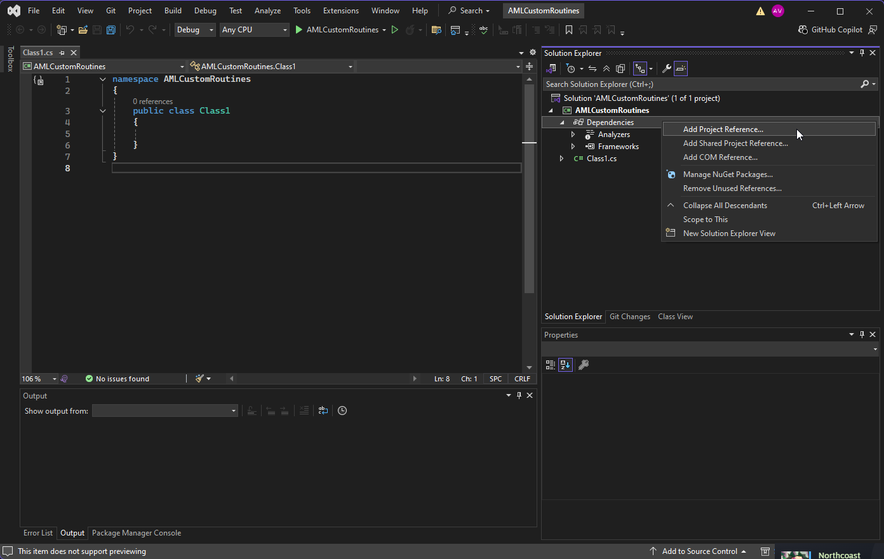
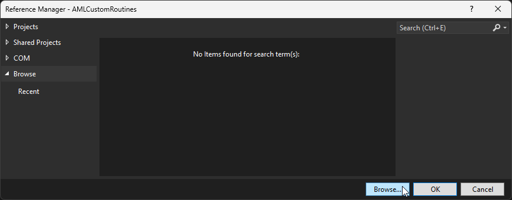
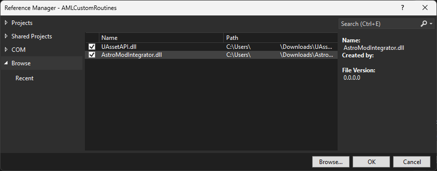
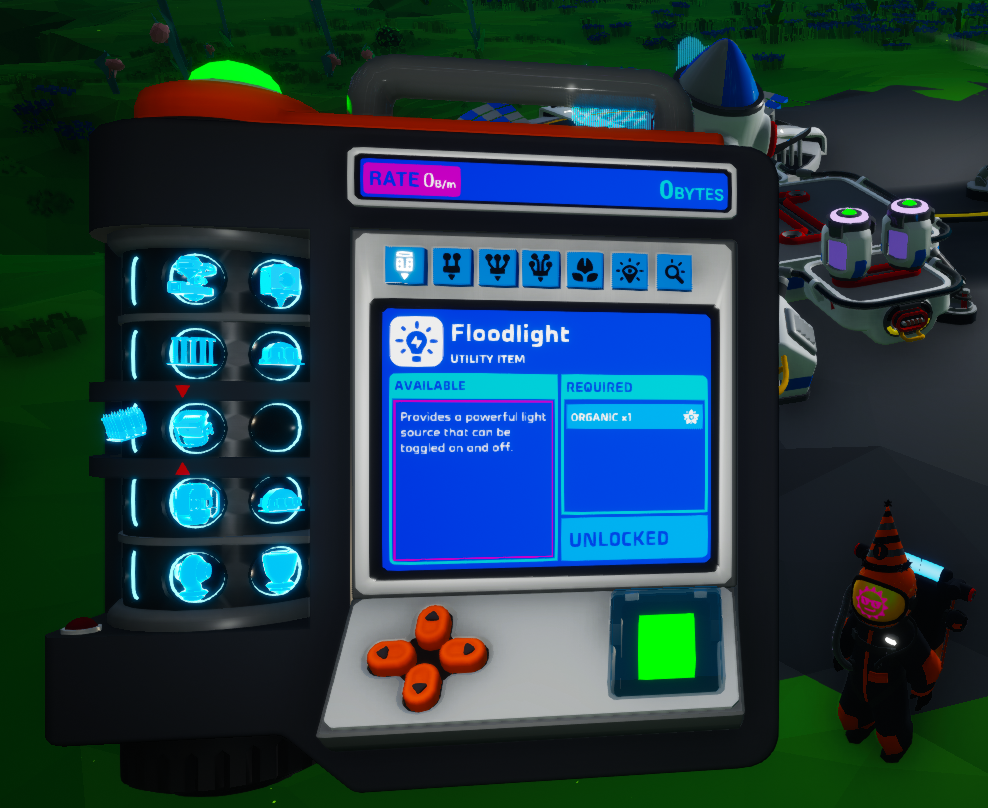

Custom Routines
=====================

.. contents:: Contents
    :depth: 3

Custom Routines 
---------------------

.. warning:: 
    Custom routines are an experimental feature in AstroModLoader Classic v1.8.0.0+ and may slightly change over time.

.. note:: 
    This is an advanced topic, so it is preferred that you already have some experience modding Astroneer.

This guide is designed to help you create custom integrator routines. Custom routines are an experimental feature, available in AstroModLoader Classic v1.8.0.0 or later.

Custom routines are segments of C# code that you can include with your mod to be executed at integration time. This allows your mod to make automatic dynamic modifications to game assets; this is similar to what can be done in UAssetGUI, but with improved power, stability, and precision. Custom routines can also read other mods' metadata, meaning that you can define your own metadata entries and modify assets on behalf of other mods, if desired. 

Custom routines are executed within a same-process sandbox layer and are also executed within an isolated low-integrity process in AstroModLoader Classic. This is intended to make it difficult to execute malicious code within a custom routine, but this also reduces the range of things that custom routines can do; for example, custom routines are not allowed to access the Internet, or modify arbitrary files on disk.

Prerequisites
---------------------

To develop custom routines, you will need to have the following things installed:

- Visual Studio 2022, version 17.8 or later

- .NET SDK, 8.0 or later

Setup
---------------------

First, you will need to download two DLL files, which we will later use in our project. You can download these files at the following links:

:download:`https://github.com/atenfyr/AstroModLoader-Classic/raw/refs/tags/v1.8.0.0/AstroModIntegrator/CustomRoutineDevKit/AstroModIntegrator.dll`
:download:`https://github.com/atenfyr/AstroModLoader-Classic/raw/refs/tags/v1.8.0.0/AstroModIntegrator/CustomRoutineDevKit/UAssetAPI.dll`

Download these two files to whatever directory you would like.

Open Visual Studio and select "Create a new project". Choose the "Class library" C# project template. Name your project "AMLCustomRoutines", and target .NET 8.0.

Once you have created the new project, you should be met with a blank class and the Solution Explorer (if not, select View -> Solution Explorer). Under the "AMLCustomRoutines" project, right-click on "Dependencies" and click "Add Project Reference...".

Click on "Browse" and browse to the AstroModIntegrator.dll file that was downloaded earlier. Then, click on "Browse" again, and browse to the UAssetAPI.dll file that was downloaded earlier.

Ensure that both .dll files appear in the window and are checked. Then, press "OK".

You are now ready to begin developing your custom routine. Copy and paste the example code below into your new Class1.cs file (or similarly named).

.. literalinclude:: Class1.cs
    :language: cs

This is a simple example of a custom routine that modifies the Floodlight to instead require 1 Organic to print instead of 1 Tungsten. If you are overwhelmed by this source code, don't worry! This source code heavily relies on `atenfyr's UAssetAPI`_, which can take some time and exposure to get a hang of. You can find further documentation and examples on using UAssetAPI here: https://atenfyr.github.io/UAssetAPI/index.html

.. _`atenfyr's UAssetAPI`: https://github.com/atenfyr/UAssetAPI

We can now build our custom routine. Select the "Release" configuration at the top of the Visual Studio window, right click on the Solution in the Solution Explorer, and click "Build Solution".

Now, right click on the "AMLCustomRoutines" project in the Solution Explorer, and click "Open Folder in File Explorer". Your output file, which is named ``AMLCustomRoutines.dll`` will be located within the ``bin\Release`` directory.

We will now package our custom routine into our mod's .pak file. Create a new folder wherever you would like, and name the folder ``000-MyCustomRoutine-0.1.0_P``.

Copy your built ``AMLCustomRoutines.dll`` file into the new ``000-MyCustomRoutine-0.1.0_P`` folder. You do not need to copy any of the other files that are located in the ``bin\Release`` directory.

Create a new ``metadata.json`` file in your ``000-MyCustomRoutine-0.1.0_P`` folder with the following contents:

.. code-block:: JSON

    {
        "schema_version": 2,
        "name": "My Custom Routine",
        "mod_id": "MyCustomRoutine",
        "author": "YOUR_NAME",
        "description": "A tutorial mod, containing a custom routine!",
        "version": "0.1.0",
        "sync": "serverclient",
        "integrator": {
            "path_to_custom_routines_dll": "AMLCustomRoutines.dll"
        }
    }

The ``path_to_custom_routines_dll`` field contains the raw path within your folder. If you would like, you can move this DLL to any folder within your pak file, and rename the file to whatever you would like, as long as the "path_to_custom_routines_dll" path is updated. If unspecified, this field defaults to "AMLCustomRoutines.dll".

Now, package the ``000-MyCustomRoutine-0.1.0_P`` folder. (If you followed the :doc:`basicSetup` guide, you would do this by right-clicking on the folder and selecting "Send to" -> "Repack folder with repak").

Load your new ``000-MyCustomRoutine-0.1.0_P.pak`` file into AstroModLoader Classic. Ensure that "Enable custom integrator routines" is checked under "Settings..." within AstroModLoader Classic.

You can view the integrator's output log by opening the ``%localappdata%\AstroModLoader\ModIntegrator.log`` file in any text editor. You should be able to see the following lines near the bottom of the log file:

.. code-block:: text

    [2026-01-10 22:11:10] Executing 1 custom routines
    [2026-01-10 22:11:10] Executing custom routine ExampleCustomRoutine1 for mod MyCustomRoutine
    [2026-01-10 22:11:10] [MyCustomRoutine] Completed ExampleCustomRoutine1
    [2026-01-10 22:11:10] Writing final integrator .pak file

If everything went right, you should now be able to launch the game and see the modified recipe for the Floodlight. 

Advanced usage: ICustomRoutineAPI
----------------------------------
You can interface with the mod integrator by executing methods implemented by the ``ICustomRoutineAPI`` interface, an instance of which is passed into the custom routine's ``Execute`` method.

Most methods that construct UAsset instances or attempt to write to files are blocked by the sandbox, so this is the primary way that most custom routines should interface with the outside world. For example, if you want to include additional resource files with your mod, you may wish to package them in your .pak file and use the ``ICustomRoutineAPI.FindFileRaw(string target)`` method.

.. literalinclude:: ICustomRoutineAPI.cs
    :language: cs

Advanced usage: JSON
----------------------------------

Below is an advanced example of a custom routine that defines a new metadata entry called ``trade_platform``, under ``integrator`` within metadata.json. It makes extensive use of the Newtonsoft.Json library, which can be installed via NuGet. As of 2026-01-10, UAssetAPI uses Newtonsoft.Json version 13.0.3.

The custom routine is implemented using the ``ICustomRoutineAPI.GetAllMods()`` method, which returns a list of `Metadata`_ instances. Custom JSON entries will be entered into the ``ExtraFields`` property of the ``Metadata`` class and the ``IntegratorEntries`` struct.

.. _`Metadata`: https://github.com/atenfyr/AstroModLoader-Classic/blob/master/AstroModIntegrator/Metadata.cs

.. collapse:: ExampleCustomRoutineTradePlatform.cs

  .. literalinclude:: ExampleCustomRoutineTradePlatform.cs
    :language: cs
