Frequently Asked Questions
============================

.. contents:: Contents
    :depth: 3

This page contains an assortment of "frequency asked questions" related to Astroneer modding, answered in short form.

If you are a modder, your contributions would be greatly appreciated, no matter how simple or complex. Adding an entry to this page is a great way to help fill some of the gaps in our existing documentation and help future modders solve difficult problems that you may have already solved.
If you'd like to contribute to this project, please submit a pull-request on the `AstroTechies/astroneermodding`_ GitHub repository that adds your new question to  `the faq.rst file`_.

.. _`AstroTechies/astroneermodding`: https://github.com/AstroTechies/astroneermodding/
.. _`the faq.rst file`: https://github.com/AstroTechies/astroneermodding/blob/main/docs/guides/faq.rst

General Questions
--------------------------

How can I get help with modding Astroneer?
^^^^^^^^^^^^^^^^^^^^^^^^^^^^^^^^^^^^^^^^^^^^^^^^^^^^^^^^^^^^^^^^^^^^^^^^^^^
If you have any questions or are facing any issues that are not answered by this documentation, please feel free to join the Astroneer Modding Discord server and ask your questions there. You can join the Discord server using the following invite link: https://discord.gg/bBqdVYxu4k

Why are there two major mod loaders (astro_modloader and AstroModLoader Classic)?
^^^^^^^^^^^^^^^^^^^^^^^^^^^^^^^^^^^^^^^^^^^^^^^^^^^^^^^^^^^^^^^^^^^^^^^^^^^^^^^^^^^^^^
The first mod loader for Astroneer was called AstroModLoader by AstroTechies (primarily developed by atenfyr in 2020). When atenfyr initially left the Astroneer Modding community in late 2021, Konsti and localcc decided to rewrite AstroModLoader, along with AstroModIntegrator and UAssetAPI, into the Rust programming language. astro_modloader (Rust) was created from this effort.

In late 2024, Konsti shut down the astroneermods.space website and left the Astroneer Modding community, which caused astro_modloader (Rust) to become unmaintained.
Shortly thereafter, atenfyr returned to the Astroneer Modding community, began to maintain astro_modloader (Rust), and also created his own updated fork of the original AstroTechies AstroModLoader, which is now AstroModLoader Classic.

Both mod loaders are currently actively maintained and are compatible with most Astroneer mods, but there are some minor variations that exist between each mod manager's implementation of the mod integrator, discussed further in the :ref:`compatibility` section of the :ref:`metadatav2` page. Most notably, astro_modloader (Rust) does not currently support UE4SS mods.

How can I implement Astroneer support for my custom mod manager?
^^^^^^^^^^^^^^^^^^^^^^^^^^^^^^^^^^^^^^^^^^^^^^^^^^^^^^^^^^^^^^^^^^^^^^^^^^^^^^^^^^^^^^
The simplest strategy for implementing Astroneer support for your own mod manager is to implement support for managing UE4SS mods, and then require that all users install the `AutoIntegrator`_ C++ mod, which is a UE4SS mod that allows AstroModLoader mods to be loaded as UE4SS LogicMods by executing the mod integrator on game launch. This reduces the complexity of the implementation to simple file management. Many other Unreal Engine games use UE4SS for managing their mods, so any implementation that brings mod support to those games can typically be cloned to implement support for Astroneer.

.. _`AutoIntegrator`: https://new.thunderstore.io/c/astroneer/p/atenfyr/AutoIntegrator/

Can I use mods on dedicated servers?
^^^^^^^^^^^^^^^^^^^^^^^^^^^^^^^^^^^^^^^^^^^^^^^^^^^^^^^^^^^^^^^^^^^^^^^^^^^^^^^^^^^^^^
Yes, you can use mods on dedicated servers. Some mods need to be installed on both the client and the server (sync = "serverclient"), whereas other mods can be installed on just the client (sync = "client") or just the server (sync = "server").

If you are playing a co-op game, no extra action needs to be taken for you to play with mods in multiplayer, as long as the other players also have the required mods installed.

If you are self-hosting a dedicated server, you can install mods by placing a copy of `AstroModLoader Classic`_ at the root folder of the server installation directory and executing the mod loader normally. You can otherwise pass the ``--server`` command line parameter to the AstroModLoader Classic executable file.

As a last resort, you can also simply copy your local ``%localappdata%\Astro\Saved\Paks`` folder (including the integrated ``999-AstroModIntegrator_P.pak`` file) onto the server machine. You would need to perform this step again along with a re-integration (by opening the mod loader again on your local machine) at least once every time that the game updates, or at any point in time that you wish to change your set of mods.

.. _`AstroModLoader Classic`: https://github.com/atenfyr/AstroModLoader-Classic

Can I use mods on Linux?
^^^^^^^^^^^^^^^^^^^^^^^^^^^^^^^^^^^^^^^^^^^^^^^^^^^^^^^^^^^^^^^^^^^^^^^^^^^^^^^^^^^^^^
Yes, you can use mods on Linux. You can execute `astro_modloader (Rust)`_ natively on Linux, or otherwise run AstroModLoader Classic through Wine + Mono.

If needed, you can also run `AstroModIntegrator Classic`_ natively on Linux via the command line (use the ModIntegrator-linux-x64 binary).

.. _`astro_modloader (Rust)`: https://github.com/AstroTechies/astro_modloader/releases/latest
.. _`AstroModIntegrator Classic`: https://github.com/atenfyr/AstroModLoader-Classic/releases/latest

Can I develop mods on Linux?
^^^^^^^^^^^^^^^^^^^^^^^^^^^^^^^^^^^^^^^^^^^^^^^^^^^^^^^^^^^^^^^^^^^^^^^^^^^^^^^^^^^^^^
Most mod development infrastructure is designed for Windows, and it is highly recommended to develop mods on the Windows operating system.

It is possible to use repak (natively), UAssetGUI (with Wine + Mono), and the Unreal Editor (natively for Ubuntu) on Linux, but guides and advice on doing so are not currently provided on this website.

Can I use mods with a pirated version of the game?
^^^^^^^^^^^^^^^^^^^^^^^^^^^^^^^^^^^^^^^^^^^^^^^^^^^^^^^^^^^^^^^^^^^^^^^^^^^
We do not provide support for users using pirated copies of Astroneer.

Can I use mods without any external mod management software?
^^^^^^^^^^^^^^^^^^^^^^^^^^^^^^^^^^^^^^^^^^^^^^^^^^^^^^^^^^^^^^^^^^^^^^^^^^^^^^^^^^^^^^
Yes, you can avoid using any external mod management software by manually executing the mod integrator via the command line, if you so choose. The mod integrator is an absolute requirement for playing with Astroneer mods. This technique will not work for UE4SS mods.

Place your .pak files manually at the appropriate path (in the ``%localappdata%\Astro\Saved\Paks`` directory on Windows). Download the ModIntegrator-win-x64.exe binary or the ModIntegrator-linux-x64 binary from the `atenfyr/AstroModLoader-Classic GitHub repository`_. Then, execute the binary with no parameters to receive information about the required command line parameters. You must execute the mod integrator at least once every time that the game updates, or at any point in time that you change your list of mods.

.. _`atenfyr/AstroModLoader-Classic GitHub repository`: https://github.com/atenfyr/AstroModLoader-Classic/releases/latest

How do I install a mod using a mod manager?
^^^^^^^^^^^^^^^^^^^^^^^^^^^^^^^^^^^^^^^^^^^^^^^^^^^^^^^^^^^^^^^^^^^^^^^^^^^^^^^^^^^^^^
Mods are distributed as .pak files. Simply drag-and-drop the mod's .pak file onto the window of the mod manager you are using.

How can I tell if a mod is compatible with the latest game version?
^^^^^^^^^^^^^^^^^^^^^^^^^^^^^^^^^^^^^^^^^^^^^^^^^^^^^^^^^^^^^^^^^^^^^^^^^^^^^^^^^^^^^^
Any mods that were last updated before November 21st, 2025 are incompatible with the latest version of the game, because the recent MEGATECH update (1.36.42.0) updated the Unreal Engine version of the game from 4.23 to 4.27, which required that all mods be re-cooked. (A similar incident occurred in 2022 with the "Xenobiology Update" [1.24.29.0], which updated the engine version from 4.18 to 4.23)

Many mods specify the ``game_build`` field in their ``metadata.json`` file, which provides information about what version of the game the mod is intended to be used with. If this version is unspecified or is not the latest version of the game, the mod is not guaranteed to work, but may work nonetheless. Any mod that is designed for game version 1.35 or earlier is guaranteed to not function on the latest version of the game.

What is a .pak file?
^^^^^^^^^^^^^^^^^^^^^^^^^^^^^^^^^^^^^^^^^^^^^^^^^^^^^^^^^^^^^^^^^^^^^^^^^^^^^^^^^^^^^^
The .pak format is an archive file format used by the Unreal Engine for storing multiple files of any type. It is similar in concept to a .zip or .rar file. These files are relatively simple to "zip" or "unzip" using external tools such as `trumank's repak`_.

The .pak format includes support for compression and encryption. As of January 2026, the Astroneer .pak file is compressed, but not encrypted.

.. _`trumank's repak`: https://github.com/trumank/repak

What is a .uasset file?
^^^^^^^^^^^^^^^^^^^^^^^^^^^^^^^^^^^^^^^^^^^^^^^^^^^^^^^^^^^^^^^^^^^^^^^^^^^^^^^^^^^^^^
The .uasset format is a file format used by the Unreal Engine to store game assets.

Game assets can either be **uncooked**, meaning that they are designed for use in the Unreal Editor, or **cooked**, meaning that they are designed to be loaded by a shipped game and have had editor data stripped for performance reasons.
Uncooked assets can be opened simply by placing them in an Unreal Editor project's ``Content`` directory and opening them in the Unreal Editor.
Cooked assets, such as those found in .pak files, can be examined and modified at a low level using tools like `atenfyr's UAssetGUI`_.

It is theoretically possible to reconstruct uncooked assets from the information contained within cooked assets, although tools to do so are currently severely limited (as of 2025), meaning that it is often easier to recreate assets in the Unreal Editor by hand. Such tools that have been developed in the past include `JsonAsAsset`_ and `UEAssetToolkitGenerator`_.

.. _`JsonAsAsset`: https://github.com/JsonAsAsset/JsonAsAsset
.. _`UEAssetToolkitGenerator`: https://github.com/LongerWarrior/UEAssetToolkitGenerator

What is a .uexp file?
^^^^^^^^^^^^^^^^^^^^^^^^^^^^^^^^^^^^^^^^^^^^^^^^^^^^^^^^^^^^^^^^^^^^^^^^^^^^^^^^^^^^^^
A .uexp file is an extension of a .uasset file, containing the body of each export in binary blob form (i.e., the "Export Information" tab in UAssetGUI). In older versions of the engine, these two files are instead merged together into a single .uasset file. For Astroneer, every .uasset file requires that a .uexp file be present with the same name in the same directory in order for the asset to be parsed.

What is the "mod integrator?"
^^^^^^^^^^^^^^^^^^^^^^^^^^^^^^^^^^^^^^^^^^^^^^^^^^^^^^^^^^^^^^^^^^^^^^^^^^^^^^^^^^^^^^
The mod integrator is a piece of software that modifies base game assets on behalf of other mods. The mod integrator executes whenever a mod is added or removed (or more often) and produces a new mod with the filename ``999-AstroModIntegrator_P.pak`` that contains automatically-modified base game assets. The purpose of the mod integrator is to allow multiple mods to make certain modifications to the same base game asset at once and thus reduce mod conflict, because a base game asset can only be modified by one mod at a time.

Mods communicate with the mod integrator by providing a ``metadata.json`` file within the mod's ``.pak`` file. The ``metadata.json`` file follows a standardized file format (see the :ref:`metadatav2` page) that contains information about what the integrator should do on the mod's behalf, among other things. This includes routines like: adding custom Actors to the level; attaching custom Actor Components to base game Actors; adding custom mission trailheads to the level; adding items to base game item lists; and so on.

Two major implementations of the "mod integrator" exist: AstroModIntegrator Classic and astro_mod_integrator (Rust). AstroModIntegrator Classic is used by AstroModLoader Classic and AutoIntegrator-based mod loaders, and astro_mod_integrator (Rust) is used by astro_modloader (Rust). There are some minor variations that exist between each of these implementations of the mod integrator, discussed further in the :ref:`compatibility` section of the :ref:`metadatav2` page.

The modding communities for some other Unreal Engine games, such as State of Decay 2, have adopted the concept of a "mod integrator" as well, but most Unreal Engine games instead choose to create mods by exclusively using tools like UE4SS, which can perform at runtime much of the actions that the mod integrator performs.

What is the difference between a package name and a raw file path?
^^^^^^^^^^^^^^^^^^^^^^^^^^^^^^^^^^^^^^^^^^^^^^^^^^^^^^^^^^^^^^^^^^^^^^^^^^^
When internally referring to the location of packages (game assets), the Unreal Engine uses the ``/Game/`` path as a shorthand for the ``Astro\Content`` directory, consistently uses the forward slash (``/``) as a directory separator instead of the backslash (``\``), and neglects file extensions.

For example, a package name could be something like ``/Game/Items/ItemTypes/FloodLight_IT``, which corresponds to the file loaded at the raw file path ``Astro\Content\Items\ItemTypes\FloodLight_IT.uasset``. When packaging a .pak file, all files should be located at their raw file path (i.e., never create a folder named ``Game`` at the root of your .pak file).

You may also see other prefixes used where a package name would be located, such as ``/Script``, which is used to refer to classes defined in a specific C++ module (see the `Source/Astro/Public directory within the ModdingKit`_ to examine classes provided under the ``/Script/Astro`` path).

.. _`Source/Astro/Public directory within the ModdingKit`: https://github.com/AstroTechies/ModdingKit/tree/master/Source/Astro/Public

Game Asset Questions
--------------------------

How can I access the base game's assets?
^^^^^^^^^^^^^^^^^^^^^^^^^^^^^^^^^^^^^^^^^^^^^^^^^^^^^^^^^^^^^^^^^^^^^^^^^^^
Follow the guide on the :ref:`basicsetup` page.

I'm getting this error when I try to unpack a .pak file: "Error reading header! Error: Unsupported pak version: 11"!
^^^^^^^^^^^^^^^^^^^^^^^^^^^^^^^^^^^^^^^^^^^^^^^^^^^^^^^^^^^^^^^^^^^^^^^^^^^^^^^^^^^^^^^^^^^^^^^^^^^^^^^^^^^^^^^^^^^^^^^^^
You are likely still using the "unreal_pak_cli" tool, which fails to parse some .pak files, including the base game's .pak file.
You should migrate to `trumank's repak`_, which is discussed further on the :ref:`basicsetup` page.

How can I examine and modify .uasset files?
^^^^^^^^^^^^^^^^^^^^^^^^^^^^^^^^^^^^^^^^^^^^^^^^^^^^^^^^^^^^^^^^^^^^^^^^^^^
You can examine and modify .uasset files using `atenfyr's UAssetGUI`_, which is discussed further on the :ref:`basicmodding` page. UAssetGUI is used to modify assets for a wide variety of different Unreal games, but it originated from the Astroneer Modding community, so it is well-suited for parsing and modifying Astroneer game assets.

.. _`atenfyr's UAssetGUI`: https://github.com/atenfyr/UAssetGUI

Can I write my own scripts for manipulating .uasset files?
^^^^^^^^^^^^^^^^^^^^^^^^^^^^^^^^^^^^^^^^^^^^^^^^^^^^^^^^^^^^^^^^^^^^^^^^^^^
Yes, you can write your own programs for manipulating .uasset files using `atenfyr's UAssetAPI`_, which UAssetGUI is based on. Several guides and some documentation for interfacing with UAssetAPI using the C# programming language are available here: https://atenfyr.github.io/UAssetAPI/

Alternatively, UAssetGUI can be used directly to convert .uasset files to-and-from the JSON format via the command line, which can then be used to indirectly examine and manipulate .uasset files in any programming language. You can find more information about UAssetGUI's command line arguments here: https://github.com/atenfyr/UAssetGUI?tab=readme-ov-file#command-line-arguments 

.. _`atenfyr's UAssetAPI`: https://github.com/atenfyr/UAssetAPI

How can I find the class that something inherits from?
^^^^^^^^^^^^^^^^^^^^^^^^^^^^^^^^^^^^^^^^^^^^^^^^^^^^^^^^^^^^^^^^^^^^^^^^^^^
In UAssetGUI, locate the BlueprintGeneratedClass export for the asset in question and click on "UStruct Data". The parent class of the class represented by this export is specified in the "Super Struct" field.

How can I find the Class Default Object of some class?
^^^^^^^^^^^^^^^^^^^^^^^^^^^^^^^^^^^^^^^^^^^^^^^^^^^^^^^^^^^^^^^^^^^^^^^^^^^
In UAssetGUI, locate the BlueprintGeneratedClass export for the asset in question and click on "UStruct Data". The Class Default Object is the export specified by the property "ClassDefaultObject". This export contains the default value of each of the class's properties for all instances of this class.

How can I get a list of properties that are available in some export?
^^^^^^^^^^^^^^^^^^^^^^^^^^^^^^^^^^^^^^^^^^^^^^^^^^^^^^^^^^^^^^^^^^^^^^^^^^^^^^^
First, download and import this set of mappings into UAssetGUI using the Utils -> Import mappings... option: :download:`Astro.usmap <Astro.usmap>`

Once these mappings are imported and then selected in the top-right of the UAssetGUI menu, you can select any export and choose the Utils -> Dump serializable properties... option. This option dumps and opens a .txt file containing all of the valid properties (and their types) that can be specified for the currently selected export.

These mappings are not required to parse assets for Astroneer (although they are required to parse assets for many other games, including almost all UE5 games), but providing UAssetGUI with a copy of these mappings does have additional benefits, including the ability to dump extra metadata and provide resolution for rare ambiguous serialization.

Why is this export missing some properties?
^^^^^^^^^^^^^^^^^^^^^^^^^^^^^^^^^^^^^^^^^^^^^^^^^^^^^^^^^^^^^^^^^^^^^^^^^^^
You are likely observing "delta serialization," where the Unreal Engine deliberately omits serializable properties that have not been changed from their default values. This means that any available property that is not specified is automatically set to its default value.

To set your own value for a property that was not written due to delta serialization, simply directly add a new row to the export containing the correct name, type, and desired value(s). See the answer to the "How can I get a list of properties that are available in some export?" question for more information on how you can determine the name and type of available properties. You do not need to manually specify the ArrayIndex, Serial Offset, or IsZero fields when creating a new row in UAssetGUI.

How can I change every instance of a string within an asset?
^^^^^^^^^^^^^^^^^^^^^^^^^^^^^^^^^^^^^^^^^^^^^^^^^^^^^^^^^^^^^^^^^^^^^^^^^^^
In many cases, this can be done by modifying the respective entry in the asset's Name Map. Modifying an entry in the Name Map will change every instance of the name in the asset from the old value to the new value.

Can I add my own imports to an asset?
^^^^^^^^^^^^^^^^^^^^^^^^^^^^^^^^^^^^^^^^^^^^^^^^^^^^^^^^^^^^^^^^^^^^^^^^^^^
Yes, you can add new rows under the "Import Data" tab as needed.

Can I add my own exports to an asset?
^^^^^^^^^^^^^^^^^^^^^^^^^^^^^^^^^^^^^^^^^^^^^^^^^^^^^^^^^^^^^^^^^^^^^^^^^^^
Yes, you can add a custom export to an asset. Simply add a new row under the "Export Information" tab, and then select View -> Recalculate Nodes.

The new export will be a typical "NormalExport". The type of the export typically cannot be changed without using UAssetAPI directly or modifying an exported .json file. It is also vitally important to ensure that all fields are specified properly for the new export, including preload dependencies, for the export to load properly in-game. Adding new exports to an asset is an advanced technique that should generally be avoided when possible.

Can I import/export assets to JSON?
^^^^^^^^^^^^^^^^^^^^^^^^^^^^^^^^^^^^^^^^^^^^^^^^^^^^^^^^^^^^^^^^^^^^^^^^^^^
Yes, you can export an asset to JSON in UAssetGUI by choosing File -> Save As and changing the output file type to "UAssetAPI JSON". You can then directly re-open the exported .json file (with or without modifications) in UAssetGUI.

The UAssetAPI JSON format is essentially a direct dump of how UAssetAPI represents the asset in memory, and is often difficult to read or effectively modify. There is also no guarantee that a UAssetAPI JSON file will properly parse in future versions of UAssetAPI/UAssetGUI, so exported .json files should generally not be used for long-term storage of assets.

What is Kismet bytecode?
^^^^^^^^^^^^^^^^^^^^^^^^^^^^^^^^^^^^^^^^^^^^^^^^^^^^^^^^^^^^^^^^^^^^^^^^^^^
"Kismet bytecode" refers to the proprietary bytecode format used by the Unreal Engine for storing blueprint graphs in cooked game assets for execution. It is similar in concept to Java bytecode or .NET's Common Intermediate Language (CIL/IL).

Can I read and modify Kismet bytecode in UAssetGUI?
^^^^^^^^^^^^^^^^^^^^^^^^^^^^^^^^^^^^^^^^^^^^^^^^^^^^^^^^^^^^^^^^^^^^^^^^^^^
You can read Kismet bytecode in UAssetGUI by selecting the "ScriptBytecode" tab within a Function export. The displayed .json format is a rudimentary visualization and is read-only; it is possible to modify Kismet bytecode by unchecking "Enable pretty bytecode" in the UAssetGUI Settings menu, although this raw format is not practical to modify to any reasonable degree.

To assist in Kismet bytecode-related work, you may wish to use `trumank's kismet-analyzer`_ tool for analyzing and manipulating Kismet bytecode, or you may wish to build `CorporalWill123's work-in-progress fork of UAssetGUI`_, which contains rudimentary node editor support for Kismet bytecode.

.. _`trumank's kismet-analyzer`: https://github.com/trumank/kismet-analyzer
.. _`CorporalWill123's work-in-progress fork of UAssetGUI`: https://github.com/Corporalwill123/UAssetGUI

What is "Raw Data" or "Extra Data" in UAssetGUI?
^^^^^^^^^^^^^^^^^^^^^^^^^^^^^^^^^^^^^^^^^^^^^^^^^^^^^^^^^^^^^^^^^^^^^^^^^^^
For many kinds of exports, UAssetAPI does not contain full serialization support, whether that be because serialization support for that specific export is deprioritized or simply incomplete. In these cases, UAssetGUI will provide an "Extra Data" entry in the tree view, allowing the remaining unparsed binary data to be viewed. In other cases, an export will fail to parse entirely because of some error in the UAssetAPI source code, which will result in the export simply being presented as a raw byte array in a "Raw Data" entry in the tree view.

For both "Extra Data" and "Raw Data", it is possible to view the data in hexadecimal form by selecting the "Extra Data" or "Raw Data" entry in the tree view. The binary data can be imported, exported, or set to a specific number of null bytes using the "Import", "Export", and "Set to null..." buttons above the hex view. In the case of the "Set to null..." button, a prompt will appear requesting the user to enter the number of desired null bytes to replace the binary data with. It is not recommended to attempt to modify this binary data except for in specific circumstances (such as when attempting to create a new export from scratch).

How can I find what asset an ObjectProperty points to?
^^^^^^^^^^^^^^^^^^^^^^^^^^^^^^^^^^^^^^^^^^^^^^^^^^^^^^^^^^^^^^^^^^^^^^^^^^^
Given an ObjectProperty within an asset, examine the asset's Import Map to find the import that the ObjectProperty points to (defined by a negative number in the property's "Variant" field). Then, follow that import's OuterIndex, which points to another import. That import will then have the path to the corresponding asset under the ``ObjectName`` column. 

See the images provided below for a visual guide on how to follow an import, using the FloodLight item type as an example. In this case, the ItemType at ``/Game/Items/ItemTypes/FloodLight_IT`` corresponds to the PhysicalItem at ``/Game/Components_Small/FloodLight_BP``.

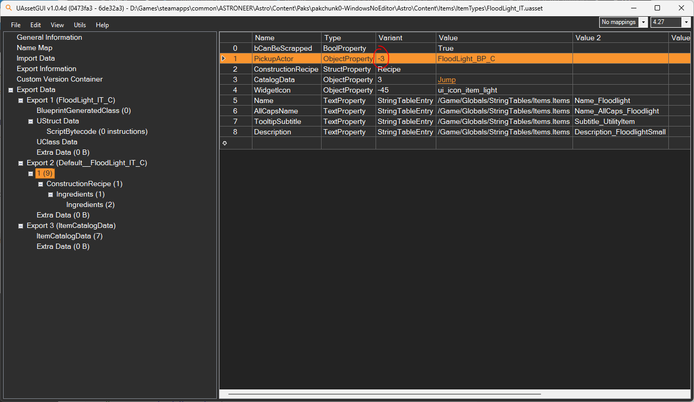

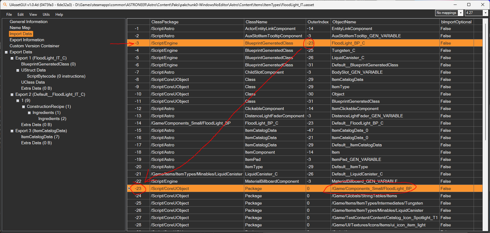

I want to modify a specific item, but I can't find its ItemType asset!
^^^^^^^^^^^^^^^^^^^^^^^^^^^^^^^^^^^^^^^^^^^^^^^^^^^^^^^^^^^^^^^^^^^^^^^^^^^
One of the most common ways to find a specific asset is to search for a specific string that is expected to occur within the asset using grep or Windows findstr.

For example, navigating to the ``Astro\Content\Items\ItemTypes`` directory and executing ``findstr /S /I /M /C:"jetpack" *.uasset`` on the Windows command line will return the paths of every file within the current directory containing the string "jetpack", recursively, including the paths to the item type assets for both the Hydrazine Jetpack and the Solid-Fuel Jump Jet.

You may wish to alternatively refer to the lookup table that was generated below using UAssetAPI on January 1st, 2026, which contains the English name of every item in the game paired with the path on disk to its ItemType asset. The relevant source code that was used to generate the lookup table is also provided for those who are interested.

.. collapse:: LookupTableIT.json

  .. literalinclude:: LookupTableIT.json
    :language: json

.. collapse:: LookupTableGenerator.cs

  .. literalinclude:: LookupTableGenerator.cs
    :language: cs

I want to modify a specific item, but I can't find its PhysicalItem asset!
^^^^^^^^^^^^^^^^^^^^^^^^^^^^^^^^^^^^^^^^^^^^^^^^^^^^^^^^^^^^^^^^^^^^^^^^^^^
Refer to the question above to try and find the ItemType asset corresponding to the PhysicalItem asset that you are looking for. Then, open the corresponding ItemType asset in UAssetGUI, and examine the ``PickupActor`` field within the Class Default Object (an export with a name starting with ``Default__``; typically Export 2 for ItemType assets). Follow this import to find the PhysicalItem asset that corresponds to the ``PickupActor`` ObjectProperty (as seen in the "How can I find what asset an ObjectProperty points to?" question).

You may wish to alternatively refer to the lookup table that was generated below using UAssetAPI on January 1st, 2026, which contains the English name of every item in the game paired with the path on disk to its PhysicalItem asset. The relevant source code that was used to generate the lookup table is also provided for those who are interested.

.. collapse:: LookupTableBP.json

  .. literalinclude:: LookupTableBP.json
    :language: json

.. collapse:: LookupTableGenerator.cs

  .. literalinclude:: LookupTableGenerator.cs
    :language: cs

How can I import a resource in UAssetGUI?
^^^^^^^^^^^^^^^^^^^^^^^^^^^^^^^^^^^^^^^^^^^^^^^^^^^^^^^^^^^^^^^^^^^^^^^^^^^
In the Import Data section of the asset in UAssetGUI, add the following imports to the bottom of your Import Map. Each of the negative numbers is a placeholder, and should be replaced with the actual number of the import in your asset.

Replace -2 with the number of the second import that was added. Replace -4 with the number of the fourth import that was added.
Replace "/Game/Items/ItemTypes/Intermediates/Carbon" with the path to the item type of the resource, and replace "Carbon_C" with the file name followed by "_C". See the "I want to modify a specific item, but I can't find its ItemType asset!" question for more information.

* Line -1: ``["/Script/Engine","BlueprintGeneratedClass","-4","Carbon_C","False",""]``
* Line -2: ``["/Game/Items/ItemTypes/Intermediates/Carbon","Carbon_C","-4","Default__Carbon_C","False",""]``
* Line -3: ``["/Script/Astro","ItemCatalogData","-2","ItemCatalogData_0","False",""]``
* Line -4: ``["/Script/CoreUObject","Package","0","/Game/Items/ItemTypes/Intermediates/Carbon","False",""]``
* Line -5: ``["/Script/Astro","ResearchSubjectDefinition","-2","ResearchSubjectDefinition_0","False",""]``

Copy and paste each of these lines into the bottom rows of the Import Data section in UAssetGUI. To refer to this object in an ObjectProperty, use the number of the first import that was added (in this case, -1).

How can I change the recipe of an existing item in UAssetGUI?
^^^^^^^^^^^^^^^^^^^^^^^^^^^^^^^^^^^^^^^^^^^^^^^^^^^^^^^^^^^^^^^^^^^^^^^^^^^
First, find the item's ItemType asset. Then, find the "ConstructionRecipe" StructProperty in the Class Default Object export (an export with a name starting with ``Default__``; typically Export 2 for ItemType assets). This struct contains an array of "Ingredients", where each entry of the array is a StructProperty of type ``ItemRecipeIngredient``.

To add a new ingredient, simply copy one of "Ingredients StructProperty ItemRecipeIngredient" rows within the Ingredients ArrayProperty and paste it to create a new, identical row. Adjust the ItemType ObjectProperty to point to the correct resource, and adjust the Count FloatProperty to be the correct number of resources. The ItemType is an ObjectProperty referencing an import that imports a resource's ItemType asset; see the "How can I import a resource in UAssetGUI?" question for more information. 

To delete one of the ingredients, simply remove the corresponding "Ingredients StructProperty ItemRecipeIngredient" row.

How can I modify an attached Actor Component in UAssetGUI?
^^^^^^^^^^^^^^^^^^^^^^^^^^^^^^^^^^^^^^^^^^^^^^^^^^^^^^^^^^^^^^^^^^^^^^^^^^^
Actor Components in Astroneer are objects "attached" to Actors that are used to handle a variety of different abstract behaviors. For items, some common components include ``ItemComponent``, ``EntityLinkComponent``, ``TerrainComponent``, ``StaticMeshComponent``, ``GravityComponent``, ``ClickableComponent``, ``SlotsComponent``, ``TooltipComponent``, ``PrinterComponent``, ``PowerComponent``, ``VehicleSlotComponent``, ``OxygenatorComponent``, ``PhysicsMovementComponent``, ``ChildSlotComponent``, ``SceneComponent``, and so on.

Each Actor Component that is attached to an Actor corresponds to a distinct Export whose type is the type of the component (for example, a PowerComponent will have a node named "PowerComponent" within the respective export). Exports are typically sorted alphabetically, which can make it much quicker to identify the export in question after using View -> Expand All in UAssetGUI.

Spaces are removed from the name of any property visible in the Unreal Editor when serializing; for example, "Net Power Output" is serialized as "NetPowerOutput".

How can I change what gases a planet has available?
^^^^^^^^^^^^^^^^^^^^^^^^^^^^^^^^^^^^^^^^^^^^^^^^^^^^^^^^^^^^^^^^^^^^^^^^^^^
Modify the "AtmosphericResources" ArrayProperty in one of the assets within ``Astro\Content\Planets\PlanetAssets`` (T2_Planet_Arid, T2_Planet_Exotic, T2_Planet_ExoticMoon, T2_Planet_Radiated, T2_Planet_Terran, T2_Planet_TerranMoon, or T2_Planet_Tundra). It is an array of "AtmosphericResource" structs, each of which has a "ResourceItemType" ObjectProperty and a "Density" FloatProperty. Typically, all gases are present in this array even if the "Density" is set to zero, so the change is trivial.

How can I change the resource of a Gateway Engine?
^^^^^^^^^^^^^^^^^^^^^^^^^^^^^^^^^^^^^^^^^^^^^^^^^^^^^^^^^^^^^^^^^^^^^^^^^^^
Modify the "Engine-Specific Ingredient" ObjectProperty in the class default object of one of the assets in ``Astro\Content\Scenarios\Gates\Engines`` (GatewayEngine_Arid, GatewayEngine_Exotic, GatewayEngine_Terran, etc.). See the "How can I import a resource in UAssetGUI?" question for more information.

You may also want to change the material used for displaying the resource: you can change the Name Map entry ``/Game/Materials/GateTech/Glyphs/MI_Chamber_Glyph_Display_ExplosivePowder`` for another material in the ``/Game/Materials/GateTech/Glyphs/`` directory, but this only works for a limited range of resources.

How can I add an item to an existing printer?
^^^^^^^^^^^^^^^^^^^^^^^^^^^^^^^^^^^^^^^^^^^^^^^^^^^^^^^^^^^^^^^^^^^^^^^^^^^
Add the following entry to your metadata.json file. If the "integrator" or "item_list_entries" tags already exist in your metadata.json file, merge these new entries with your existing entries.

.. code-block:: json

  "integrator": {
      "item_list_entries": {
          "/Game/Items/BackpackRail": {
              "PrinterComponent.Blueprints": [
                  "/Game/PATH/TO/ITEM/TO/ADD/ExampleItem_BP"
              ]
          }
      }
  }

Replace ``/Game/Items/BackpackRail`` with one of the following entries, depending on which printer you would like to add the item to:

* ``/Game/Items/BackpackRail``: Backpack Printer
* ``/Game/Components_Small/Printer_Breadboards_T1``: Small Printer
* ``/Game/Components_Medium/Printer_Breadboards_T2``: Medium Printer
* ``/Game/Components_Large/Printer_Breadboards_T3``: Large Printer

If your mod does nothing other than add a vanilla item to a printer, then you don't need to include anything else in your .pak file other than the metadata.json file.

How can I have my item start off as "hacked" in the Glitchwalkers DLC?
^^^^^^^^^^^^^^^^^^^^^^^^^^^^^^^^^^^^^^^^^^^^^^^^^^^^^^^^^^^^^^^^^^^^^^^^^^^
Add the following entry to your metadata.json file. If the "integrator" or "item_list_entries" tags already exist in your metadata.json file, merge these new entries with your existing entries.

.. code-block:: json

  "integrator": {
      "item_list_entries": {
          "/Game/U32_Expansion/Items/HackedCatalog/InitialHackedItemList": {
              "ItemTypes": [
                  "/Game/PATH/TO/ITEM/TO/ADD/ExampleItem_BP"
              ]
          },
          "/Game/U32_Expansion/Items/HackedCatalog/GW_VP000_Unhack_ItemList": {
              "ItemTypes": [
                  "/Game/PATH/TO/ITEM/TO/ADD/ExampleItem_BP"
              ]
          }
      }
  }

Replace ``/Game/U32_Expansion/Items/HackedCatalog/GW_VP000_Unhack_ItemList`` with one of the following entries, depending on which rootkit you want to unlock the item:

* ``/Game/U32_Expansion/Items/HackedCatalog/GW_VP000_Unhack_ItemList``: Alpha Rootkit
* ``/Game/U32_Expansion/Items/HackedCatalog/GW_VP001_Unhack_ItemList``: Delta Rootkit
* ``/Game/U32_Expansion/Items/HackedCatalog/GW_VP002_Unhack_ItemList``: Zeta Rootkit

You do not need to have the Glitchwalkers DLC purchased or installed to implement this feature or use mods that implement this feature.

If your mod does nothing other than make a vanilla item "hacked" or "unhacked" in the Glitchwalkers DLC, then you don't need to include anything else in your .pak file other than the metadata.json file.

Unreal Editor Questions
--------------------------

When I try to open the .uproject file, I get the error "Astro could not be compiled."!
^^^^^^^^^^^^^^^^^^^^^^^^^^^^^^^^^^^^^^^^^^^^^^^^^^^^^^^^^^^^^^^^^^^^^^^^^^^^^^^^^^^^^^^^^^
Make sure that the .uproject file you are opening was downloaded as part of the AstroTechies ModdingKit, and that you have installed UE 4.27 from the Epic Games Launcher. You may wish to attempt to right-click the .uproject file and select "Generate Visual Studio project files". Then, open the ``Astro.sln`` file, and attempt to build the project from source manually.

My custom item won't show up in the research catalog!
^^^^^^^^^^^^^^^^^^^^^^^^^^^^^^^^^^^^^^^^^^^^^^^^^^^^^^^^^^^^^^^^^^^^^^^^^^^^^^^^^^^^^^^^^^
This is a general indicator that there is some issue in your mod setup or in the configuration of your item. You may wish to first verify that your metadata.json is set-up properly.

My custom item is overwriting another item in the printer menu!
^^^^^^^^^^^^^^^^^^^^^^^^^^^^^^^^^^^^^^^^^^^^^^^^^^^^^^^^^^^^^^^^^^^^^^^^^^^^^^^^^^^^^^^^^^
For items that are printed in any printer other than the backpack printer, the item must be to the right of the item's base item in the catalog (i.e., your "Variant Type" must be set to "Right" instead of "Left").

You may wish to consider creating your own row in the catalog for your item. When doing so, you must also ensure that the category sequence number and variation sequence number do not overlap with an existing item.

Can I test mods within the Unreal Editor?
^^^^^^^^^^^^^^^^^^^^^^^^^^^^^^^^^^^^^^^^^^^^^^^^^^^^^^^^^^^^^^^^^^^^^^^^^^^^^^^^^^^^^^^^^^
No, you must test your mods in the actual game by cooking your assets, packaging the mod, executing the integrator/mod manager, and starting the game. There are options available to help automate this process: see the answer to the "How can I speed up the mod deployment process (cook, copy files, package, integrate, launch)?" question.

How can I reference a base game asset in my own assets?
^^^^^^^^^^^^^^^^^^^^^^^^^^^^^^^^^^^^^^^^^^^^^^^^^^^^^^^^^^^^^^^^^^^^^^^^^^^^^^^^^^^^^^^^^^
If one does not already exist in the ModdingKit, you will need to create your own "dummy" asset in the editor at the same file path as the base game asset. The new asset should inherit from the same class that the base game asset inherits from (see "How can I find the class that something inherits from?") and contain any properties, components, events, or functions that you wish to reference in your own code and that the base game asset also has. This dummy asset should only be used in the editor and should not be included with your packaged mod.

A dummy asset need not be a fully accurate replica of a base game asset, but any properties, components, events, or functions that you add to the dummy asset should actually exist in the original asset; attempting to access a property or component that does not actually exist in-game may result in a game crash.

How can I add a body slot to my PhysicalItem?
^^^^^^^^^^^^^^^^^^^^^^^^^^^^^^^^^^^^^^^^^^^^^^^^^^^^^^^^^^^^^^^^^^^^^^^^^^^
To add a "body slot" (which is the slot that allows your item to slot onto platforms, etc.), add a new Child Slot Component called "BodySlot" and attach it to your Static Mesh Component. Move the slot to its desired location, and modify the "Rotation" parameter so that the blue arrow is facing normal to the surface the slot is on (typically, downwards). Under the Details pane, change the "Child Slot Class" to one of the following:

* ``PowerSlot_BodySlot``: T1 slot
* ``Chassis_BodySlot``: T2 slot
* ``LargeChassis_BodySlot``: T3 slot
* ``XLChassis_BodySlot``: T4 slot

Note that these types are different than the types used for non-body slots.

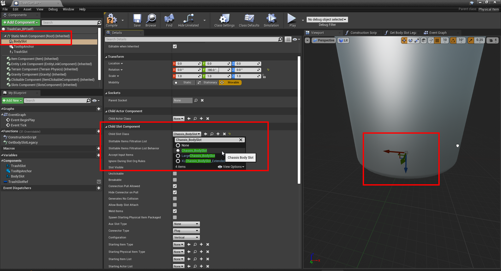

Then, you must create a new "Get Body Slot Legacy" function on our item. Click on the "Override" dropdown next to "Functions" and select "Get Body Slot Legacy".

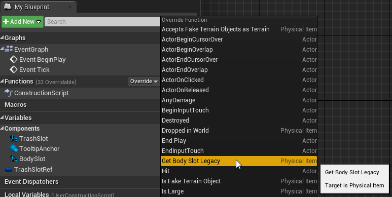

Then, simply set the function to return a copy of the "Body Slot" variable, which should have been automatically created when you added the new Child Slot Component.

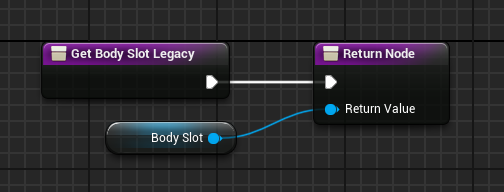

How can I add a slot to my new item?
^^^^^^^^^^^^^^^^^^^^^^^^^^^^^^^^^^^^^^^^^^^^^^^^^^^^^^^^^^^^^^^^^^^^^^^^^^^
As is done for the body slot, first add a new Child Slot Component of any name attached to the Static Mesh Component. The slot should be rotated so that the blue arrow is facing normal to the surface it is on (typically, upwards). Change the Child Slot Class to one of the following:

* ``PowerSlotGeneric``: T1 slot
* ``ChassisSlot``: T2 slot
* ``LargeChassisSlot``: T3 slot
* ``XLChassisSlot``: T4 slot
* ``PowerSlot_StreamingCable``: power cable slot; change "Configuration" to "Horizontal"

Note that these types are different than the types used for body slots.

If your item has custom (non-body) slots, you should also add a Storage Chassis Component and an Actor Streaming Power Node Component (named "ActorStreamingPowerNode") to your PhysicalItem class. The fields of these components do not necessarily need to be changed from their default values, but the components should be present nonetheless.

To set up the Actor Streaming Power Node, add the following data to the PhysicalItem's Entity Link Component:

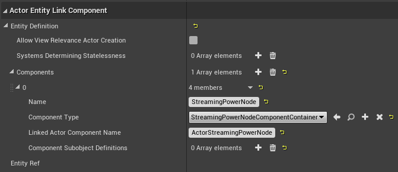d Actor Component Name" to "ActorStreamingPowerNode", and leave "Component Subobject Definitions" as an empty array

How can I have my item consume/produce power?
^^^^^^^^^^^^^^^^^^^^^^^^^^^^^^^^^^^^^^^^^^^^^^^^^^^^^^^^^^^^^^^^^^^^^^^^^^^
Add a PowerComponent to your PhysicalItem with the "Net Power Output" field set to either a positive value (generated power in U/s) or a negative value (consumed power in U/s). If power is being generated, check the "Is Generator" checkbox.

How can I add a custom interaction to my item?
^^^^^^^^^^^^^^^^^^^^^^^^^^^^^^^^^^^^^^^^^^^^^^^^^^^^^^^^^^^^^^^^^^^^^^^^^^^
Under the PhysicalItem's "Clickable Component", enable the "Has Use Interaction by Default" field, and, if applicable, enable the "Has Aux Slot Use by Default", "Has Actuator Use by Default", and the "Has Use While Player Driving" fields. Change the "Default Use Context" field to whatever should be displayed by default in the item tooltip as the "use context".

Then, add the "InputAction Use" event to the Event Graph (under Input, Action Events, Use), and attach whatever blueprint code you would like to execute when the item is used to the "Pressed" node.

You can use the "Set Active Use Context" node to change the current use context (for example, to change the tooltip text from "Turn On" to "Turn Off").

How can I execute some Blueprint code on game load, or every tick?
^^^^^^^^^^^^^^^^^^^^^^^^^^^^^^^^^^^^^^^^^^^^^^^^^^^^^^^^^^^^^^^^^^^^^^^^^^^
Create a new Actor, and implement your code under the "Event BeginPlay" node, or the "Event Tick" node, as desired. Then, add the package file name for your new actor to the ``persistent_actors`` integrator entry in your metadata.json file, which will instruct the integrator to add your actor to the level.

Alternatively, you can instead create a new Actor Component, and add the path to your new Actor Component to your metadata.json file under ``/Game/Globals/PlayControllerInstance`` in the ``linked_actor_components`` entry. This will attach your custom ActorComponent to each Player Controller. An older style of mod development, pioneered before the creation of the ``persistent_actors`` integrator entry, was to spawn an Actor into the level (if one did not already exist) within an Actor Component attached to the Player Controller.

"Event BeginPlay" will be executed when the game fully loads, and it will also be executed whenever a save is loaded (on a different instance of the Actor).

How can I make my custom Actor get saved when the user saves the game?
^^^^^^^^^^^^^^^^^^^^^^^^^^^^^^^^^^^^^^^^^^^^^^^^^^^^^^^^^^^^^^^^^^^^^^^^^^^
After cooking your assets, you will have to use UAssetGUI to add a new "bSaveGameRelevant" BoolProperty set to "true" within the class default object. This step is not necessary for PhysicalItem classes, which automatically have bSaveGameRelevant set to true.

How can I allow my users to configure my mod?
^^^^^^^^^^^^^^^^^^^^^^^^^^^^^^^^^^^^^^^^^^^^^^^^^^^^^^^^^^^^^^^^^^^^^^^^^^^
You can expose a blueprint property to be configurable by checking the "Config Variable" flag on the property (you may need to click the "Show Advanced" arrow button to see this option). This allows users to specify a custom entry in the Engine.ini file to change the property's default value. The new entry will be available in the Engine.ini file under the header ``[/Game/Path/To/Your/ActorFileName.ActorFileName_C]`` (with the appropriate path and file name).

How can I have one of my custom missions be activated by a vanilla mission?
^^^^^^^^^^^^^^^^^^^^^^^^^^^^^^^^^^^^^^^^^^^^^^^^^^^^^^^^^^^^^^^^^^^^^^^^^^^^^^
The following blueprint code is part of the Rocket Launcher Mod example by atenfyr in the AstroTechies ModdingKit, and is placed in a persistent actor:

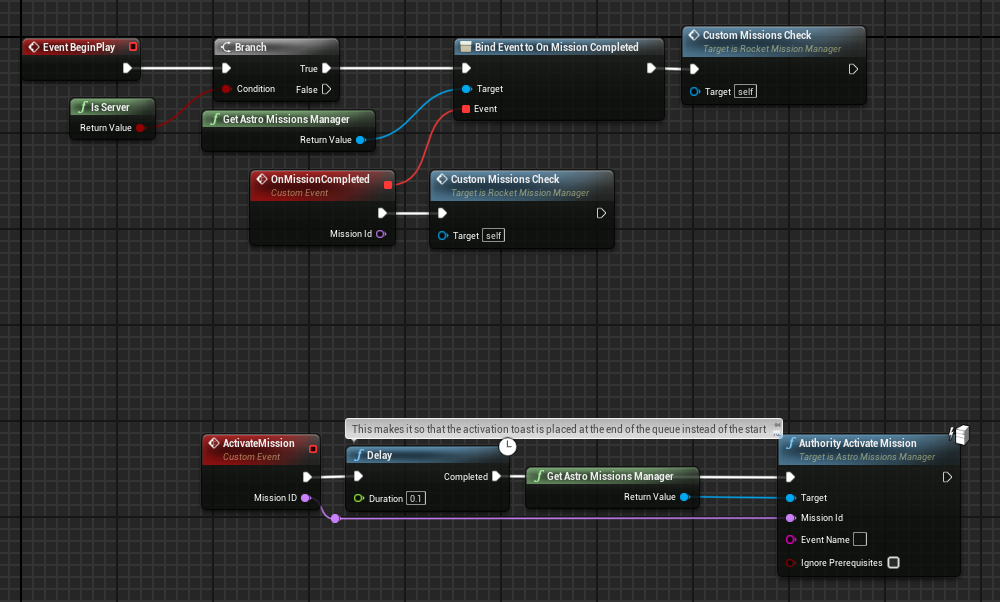

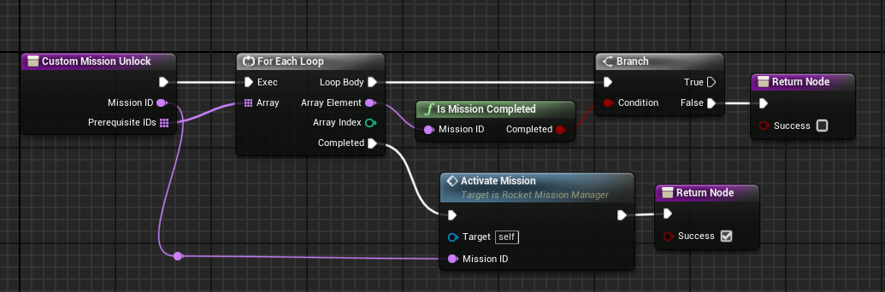

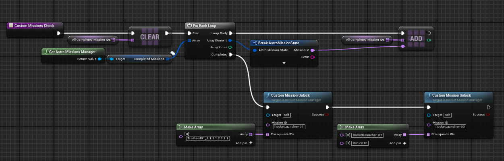

How can I detect which mod loader the user is using?
^^^^^^^^^^^^^^^^^^^^^^^^^^^^^^^^^^^^^^^^^^^^^^^^^^^^^^^^^^^^^^^^^^^^^^^^^^^
Refer to the code segment below. You must reference ``IntegratorStatics_BP`` in the construct node. AstroModIntegrator Classic will return a version like "Classic 1.6.2.0", while astro_modloader (Rust) will return a version like "0.1.12".

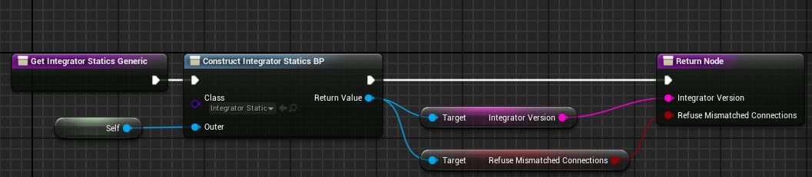

How can I get a list of all mods that are enabled?
^^^^^^^^^^^^^^^^^^^^^^^^^^^^^^^^^^^^^^^^^^^^^^^^^^^^^^^^^^^^^^^^^^^^^^^^^^^
Refer to the code segment below. "Out" is a local variable; it is a map with the key type set to "Name" and the value type set to "Mod". This code is compatible with both AstroModLoader Classic and astro_modloader (Rust).

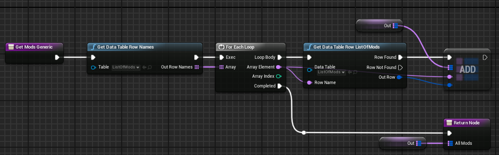

How can I add toggleable spherical gravity to an item?
^^^^^^^^^^^^^^^^^^^^^^^^^^^^^^^^^^^^^^^^^^^^^^^^^^^^^^^^^^^^^^^^^^^^^^^^^^^
This question was contributed by Discord user DaFakeBillGates in the Astroneer Modding Discord server's #mod-resources channel.

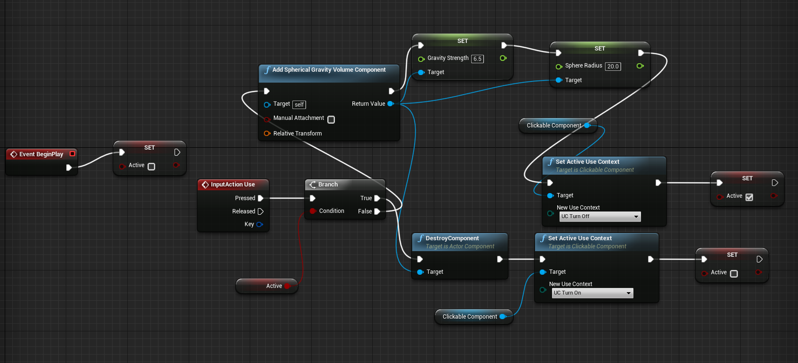

How can I add collision to a slotted item?
^^^^^^^^^^^^^^^^^^^^^^^^^^^^^^^^^^^^^^^^^^^^^^^^^^^^^^^^^^^^^^^^^^^^^^^^^^^
This question was contributed by Discord user ChunkySpaceman in the Astroneer Modding Discord server's #mod-resources channel.

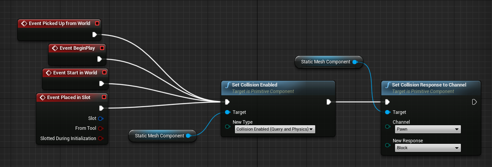

How can I summon a resource nugget?
^^^^^^^^^^^^^^^^^^^^^^^^^^^^^^^^^^^^^^^^^^^^^^^^^^^^^^^^^^^^^^^^^^^^^^^^^^^
This question was contributed by Discord user ChunkySpaceman in the Astroneer Modding Discord server's #mod-resources channel.

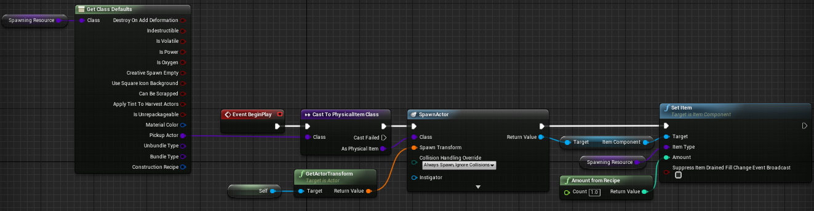

How can I add oxygen support to an item?
^^^^^^^^^^^^^^^^^^^^^^^^^^^^^^^^^^^^^^^^^^^^^^^^^^^^^^^^^^^^^^^^^^^^^^^^^^^
This question was contributed by Discord user thecodingpro in the Astroneer Modding Discord server's #mod-resources channel.

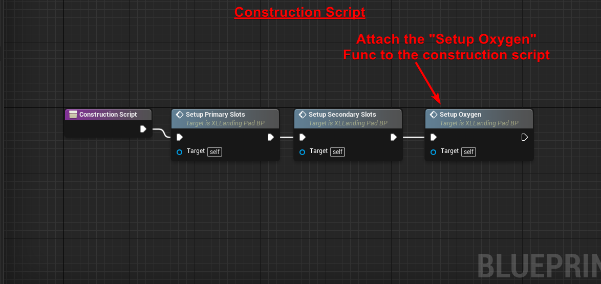

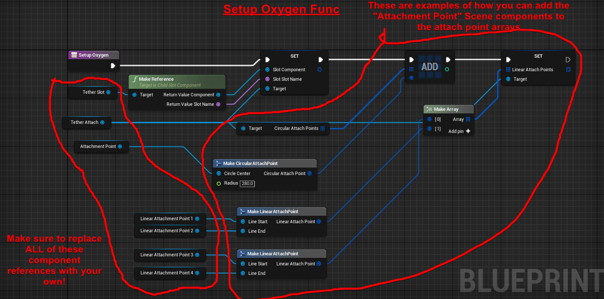

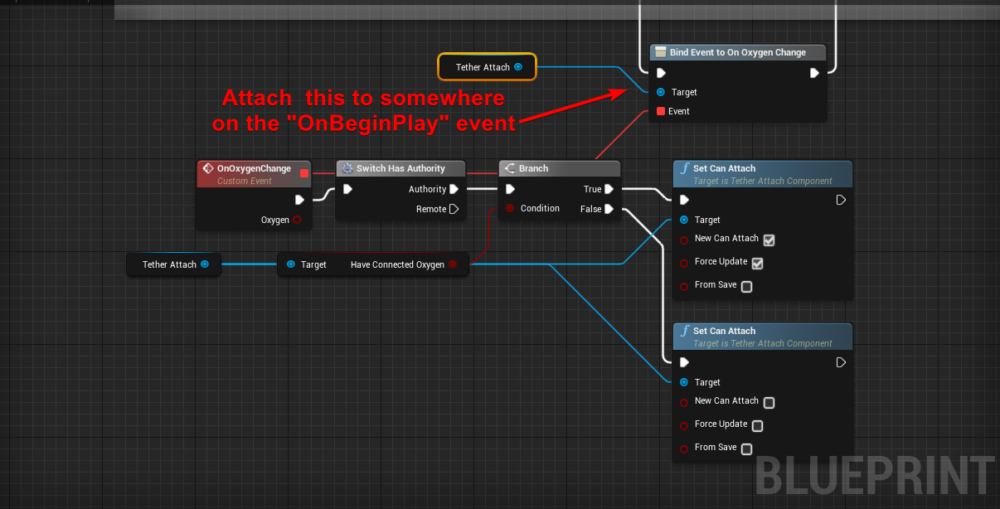

How can I get the data of all the missions that the player has tracked?
^^^^^^^^^^^^^^^^^^^^^^^^^^^^^^^^^^^^^^^^^^^^^^^^^^^^^^^^^^^^^^^^^^^^^^^^^^^
This question was contributed by Discord user g.dutch in the Astroneer Modding Discord server's #mod-resources channel.

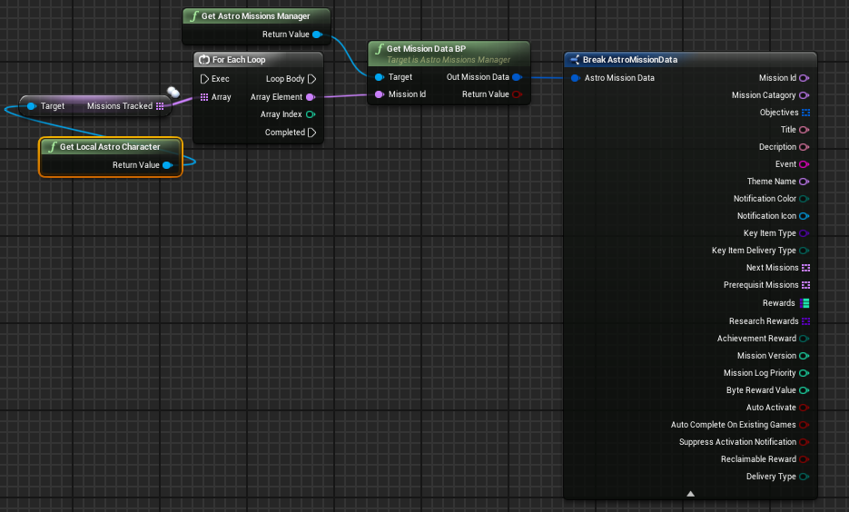

How can I generate a unique ID for a save game?
^^^^^^^^^^^^^^^^^^^^^^^^^^^^^^^^^^^^^^^^^^^^^^^^^^^^^^^^^^^^^^^^^^^^^^^^^^^
This technique was contributed by Discord user g.dutch in the Astroneer Modding Discord server's #mod-resources channel.

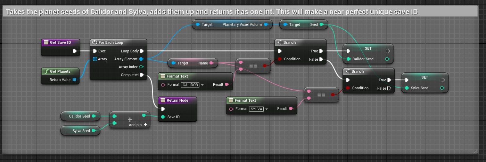

How can I speed up the mod deployment process (cook, copy files, package, integrate, launch)?
^^^^^^^^^^^^^^^^^^^^^^^^^^^^^^^^^^^^^^^^^^^^^^^^^^^^^^^^^^^^^^^^^^^^^^^^^^^^^^^^^^^^^^^^^^^^^^^^^
Several tools have been created to help automate the mod deployment process, such as `GDutch's AstroModPackager`_ or the ModDeployer plugin that is included with the AstroTechies ModdingKit.

With the AstroTechies ModdingKit installed, you can open the ModDeployer plugin in the Unreal Editor by selecting Window -> Mod Deployer. Then, press the "Help" button within the Mod Deployer window to obtain further instructions on how the plugin is used. You can later choose Window -> Quick Deploy or press F5 (by default) to instantly execute the "Run everything" action.

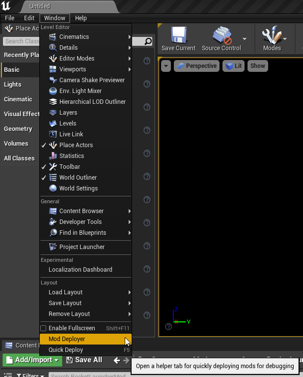

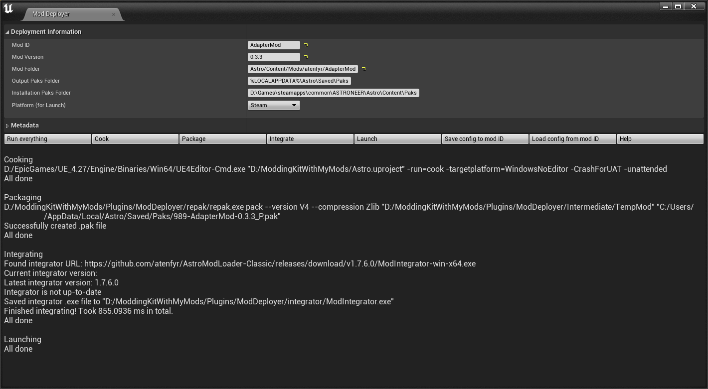

.. _`GDutch's AstroModPackager`: https://github.com/GuidovanHoboken/AstroModPackager

How can I extract sounds from the game?
^^^^^^^^^^^^^^^^^^^^^^^^^^^^^^^^^^^^^^^^^^^^^^^^^^^^^^^^^^^^^^^^^^^^^^^^^^^
Sounds in Astroneer are stored as Wwise .wem files, with many .wem files being contained within Wwise .bnk archive files located in the ``Astro/Content/WwiseAudio/Windows`` directory. You can extract and edit .bnk archive files using tools like `eXpl0it3r's bnkextr`_ or `monkeyman192's bnkEditor`_. Astroneer .wem files can be converted to-and-from .wav files using `atenfyr's wem2wav2wem.py script`_.

It is currently not feasible to modify base game .bnk files without directly patching the original .pak file, which makes it somewhat impractical to create mods that change game sounds. Further research is necessary in this field.

.. _`eXpl0it3r's bnkextr`: https://github.com/eXpl0it3r/bnkextr
.. _`monkeyman192's bnkEditor`: https://github.com/monkeyman192/bnkEditor
.. _`atenfyr's wem2wav2wem.py script`: https://gist.github.com/atenfyr/26c91a534ff8d801501d3c5423160ad9

Can I add custom cosmetics to the game?
^^^^^^^^^^^^^^^^^^^^^^^^^^^^^^^^^^^^^^^^^^^^^^^^^^^^^^^^^^^^^^^^^^^^^^^^^^^
We heavily discourage modders from attempting to add custom cosmetics to the game or otherwise tamper with the game's cosmetics systems. The ability to create or modify cosmetics would directly conflict with System Era's systems for paid cosmetics, which could pose a threat to the modding community as a whole.

Where can I find some example mods?
^^^^^^^^^^^^^^^^^^^^^^^^^^^^^^^^^^^^^^^^^^^^^^^^^^^^^^^^^^^^^^^^^^^^^^^^^^^
A variety of example mods are provided as part of the AstroTechies ModdingKit, in the ``Astro/Content/Mods`` directory. You are encouraged to refer to these examples while creating your own mods.

UE4SS Questions
--------------------------

What is UE4SS, and what can I use it for?
^^^^^^^^^^^^^^^^^^^^^^^^^^^^^^^^^^^^^^^^^^^^^^^^^^^^^^^^^^^^^^^^^^^^^^^^^^^
UE4SS (the Unreal Engine 4/5 Scripting System) is a powerful open-source framework for scripting and modding Unreal Engine games at runtime. UE4SS allows you to execute Lua scripts (or even inject custom C++ mods) that can reference and manipulate arbitrarily Unreal Engine objects and properties in real-time. You can find more information about UE4SS on the `UE4SS-RE/RE-UE4SS GitHub repository`_.

In the context of Astroneer mods, UE4SS is often used specifically for accessing properties and functions that are inaccessible through blueprints, or for creating hooks into engine functions to accomplish tasks that would be much more complex or impossible to perform through blueprints alone. Most mods do not necessarily need to use UE4SS, but a UE4SS script can often significantly reduce the complexity of implementation for some mods, or accomplish things that are not possible to do through blueprints alone (such as file access or Internet access).

One common development strategy is to use UE4SS primarily to directly hook certain functions or access certain properties as required, and then perform the bulk of the logic within blueprints by executing blueprint methods via Lua. You may wish to reference these guides for the video game Palworld for more information on developing Lua scripts for UE4SS: https://pwmodding.wiki/docs/category/lua-modding

.. _`UE4SS-RE/RE-UE4SS GitHub repository`: https://github.com/UE4SS-RE/RE-UE4SS

How can I add a UE4SS .lua script to my mod?
^^^^^^^^^^^^^^^^^^^^^^^^^^^^^^^^^^^^^^^^^^^^^^^^^^^^^^^^^^^^^^^^^^^^^^^^^^^
Set the "enable_ue4ss" field to "true" in your metadata.json file, as in the example below:

.. code-block:: json

    {
        "schema_version": 2,
        "name": "Tutorial Mod",
        "mod_id": "TutorialMod",
        "author": "YOUR_NAME",
        "description": "A tutorial mod.",
        "version": "0.1.0",
        "sync": "serverclient",
        "enable_ue4ss": true
    }

Then, add a .lua script within your .pak file at the path ``UE4SS\Scripts\main.lua`` (where the UE4SS directory is at the root of your .pak file). If you are developing a C++ mod, you may place your .dll file at ``UE4SS\dlls\main.dll`` within your .pak file.

You may wish to examine the following ``main.lua`` script as an example for testing UE4SS capability. The ``UEHelpers.lua`` and ``AstroHelpers.lua`` files are provided as shared libraries automatically by AstroModLoader Classic and AutoIntegrator-based mod loaders.

.. collapse:: main.lua

  .. literalinclude:: main.lua
    :language: lua

.. collapse:: UEHelpers.lua (as of 2025-12-31)

  .. literalinclude:: UEHelpers.lua
    :language: lua

.. collapse:: AstroHelpers.lua (as of 2025-12-31)

  .. literalinclude:: AstroHelpers.lua
    :language: lua

.. warning::

   UE4SS mods are only supported by AstroModLoader Classic and AstroModIntegrator Classic-based mod loaders (such as AutoIntegrator, Vortex Mod Manager). If the ``enable_ue4ss`` field is specified, your mod will no longer be compatible with astro_modloader (Rust).

What is AutoIntegrator?
^^^^^^^^^^^^^^^^^^^^^^^^^^^^^^^^^^^^^^^^^^^^^^^^^^^^^^^^^^^^^^^^^^^^^^^^^^^

`atenfyr's AutoIntegrator`_ is a UE4SS C++ mod that allows AstroModLoader .pak mods to be loaded as typical UE4SS LogicMods. It does this by executing AstroModIntegrator Classic in the background every time that the game launches. The mod is not required for users to use UE4SS with Astroneer, but it can help reduce reliance on external mod management software.

.. _`atenfyr's AutoIntegrator`: https://new.thunderstore.io/c/astroneer/p/atenfyr/AutoIntegrator/
